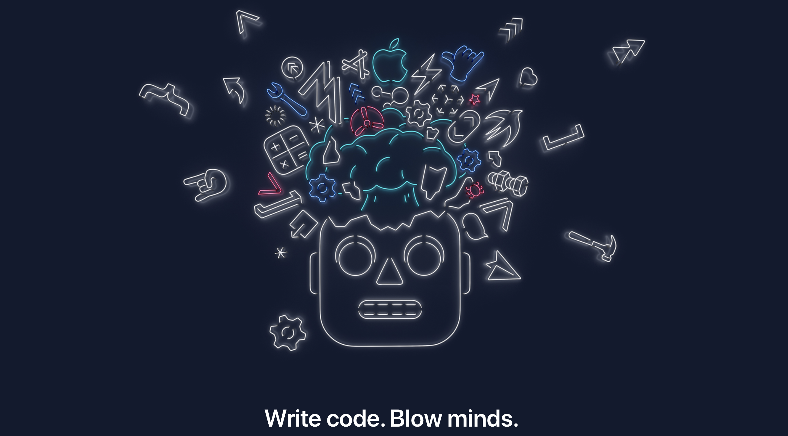

# WWDC-Recap
Summaries for the sessions from WWDC 19 & 17 in markdown format.

These notes are not intended to replace the full experience. They are just side notes if you want to check during/after the session or to get a brief idea before diving into.

Any PR's are welcomed for the sessions I couldn't attend. :pray:

Enjoy !

# [WWDC19](./WWDC19)

## Keynote
### [WWDC 2019 Keynote](./WWDC19/Keynote.md)
### [Platforms State of the Union](./WWDC19/Platforms_state_of_the_union.md)

================================================

==============================================

# [WWDC17](./WWDC17)

## Keynote
### [WWDC 2017 Keynote](./WWDC17/Keynote/Keynote.md)
### [Platforms State of the Union](./WWDC17/WWDC17Keynote/Platforms_State_of_the_Union.md)

## Design
### [Design Studio Shorts 2](./WWDC17/Design%20Sessions/Design_Studio_Shorts_Part_2.md)
### [Essential Design Principles](./WWDC17/Design%20Sessions/Essential_Design_Principles.md)

## Technical
### [Advances in Networking, Part 1](./WWDC17/Technical%20Sessions/Advances_in_Networking_Part_1.md)
### [App Startup Time: Past, Present, and Future](./WWDC17/Technical%20Sessions/App_Startup_TIme_Past_Present_Future.md)
### [Auto Layout Techniques in Interface Builder](./WWDC17/Technical%20Sessions/Autolayout_Techniques_in_Interface_Builder.md)
### [Building Visually Rich User Experiences](./WWDC17/Technical%20Sessions/Building_Visually_Rich_Interfaces.md)
### [Choosing the Right Cocoa Container View](./WWDC17/Technical%20Sessions/Choosing_the_right_cocoa_container_view.md)
### [Core ML in depth](./WWDC17/Technical%20Sessions/Core_ML_in_Depth.md)
### [Data Delivery with Drag and Drop](./WWDC17/Technical%20Sessions/Data_Delivery_with_Drag_Drop.md)
### [Debugging with Xcode 9](./WWDC17/Technical%20Sessions/Debugging_with_XCode9.md)
### [Efficient Interactions with Frameworks](./WWDC17/Technical%20Sessions/Efficient_Interactions_with_Frameworks.md)
### [Engineering for Testability](./WWDC17/Technical%20Sessions/Engineering_for_testability.md)
### [Finding Bugs Using Xcode Runtime Tools](./WWDC17/Technical%20Sessions/Finding_bugs_using_XCode_runtime_tools.md)
### [Introducing ARKit: Augmented Reality for iOS](./WWDC17/Technical%20Sessions/Introduction_to_ARKit.md)
### [Introducing Core ML](./WWDC17/Technical%20Sessions/Machine_Learning.md)
### [Modernizing Grand Central Dispatch Usage](./WWDC17/Technical%20Sessions/Modernizing_GCD_Usage.md)
### [Natural Language Processing and your Apps](./WWDC17/Technical%20Sessions/Natural_Language_Processing.md)
### [Privacy and Your Apps](./WWDC17/Technical%20Sessions/Privacy_and_your_apps.md)
### [The Keys to a Better Text Input Experience](./WWDC17/Technical%20Sessions/The_Keys_to_a_Better_Text_Input_Experience.md)
### [Updating Your App for iOS 11](./WWDC17/Technical%20Sessions/Updating_Your_Apps_to_iOS11.md)
### [Using Metal 2 for Compute](./WWDC17/Technical%20Sessions/Using_Metal_2_for_Compute.md)
### [What's New in Core Bluetooth](./WWDC17/Technical%20Sessions/Whats_New_in_Core_Bluetooth.md)
### [What's New in Foundation](./WWDC17/Technical%20Sessions/Whats_New_in_Foundation.md)
### [What's New in LLVM](./WWDC17/Technical%20Sessions/Whats_New_in_LLVM.md)
### [What's New in Location Technologies](./WWDC17/Technical%20Sessions/Whats_New_in_Location_Technologies.md)
### [What's New in SiriKit](./WWDC17/Technical%20Sessions/Whats_New_in_SiriKit.md)
### [What's New in Swift](./WWDC17/Technical%20Sessions/Whats_New_in_Swift.md)
### [What’s New in Swift Playgrounds](./WWDC17/Technical%20Sessions/Whats_New_in_Swift_Playgrounds.md)
### [What's New in Testing](./WWDC17/Technical%20Sessions/Whats_New_in_Testing.md)
### [Writing Energy Efficient Apps](./WWDC17/Technical%20Sessions/Writing_Energy_Efficient_Apps.md)
### [Your Apps and Evolving Network Security Standards](./WWDC17/Technical%20Sessions/Your_apps_and_evolving_network_standards.md)
