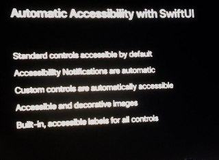

WWDC19
# Table of Contents
=================

   * [Table of Contents](#table-of-contents)
   * [Accessibility in SwiftUI - Friday](#accessibility-in-swiftui---friday)
      * [Automatic Accessibility with SwiftUI](#automatic-accessibility-with-swiftui)
      * [SwiftUI Accessibility API](#swiftui-accessibility-api)
         * [Understandable](#understandable)
         * [Interactable](#interactable)
         * [Navigable](#navigable)
      * [Evaluating Accessibility](#evaluating-accessibility)

# Accessibility in SwiftUI - Friday
Session materials: https://developer.apple.com/videos/play/wwdc2019/238/

- Make your app usable by all of your customers

## Automatic Accessibility with SwiftUI
  - SwiftUI makes items accessible automatically for some elements like `Text()` and generates accessibility elements

  

## SwiftUI Accessibility API
```
SomeView()
.accessibility(label: Text())
.accessibility(value: Text())
.accessibilityAction(named: Text()) {
  clear()
}
```

### Understandable
  - Do the displayed strings provide enough information?
  `.accessibility(visibilty: .hidden)` to exclude unnecessary items from accessibility
  - Provide context by adding labels, values and hints
### Interactable
  - Does a custom action simplify the interaction?
  - Simplify by adding custom actions
### Navigable
  - Can you speed up navigation?
    - Give specific headers to focus the user onto key areas
  - Speed up elements by grouping

## Evaluating Accessibility
  - Use your app with
    - VoiceOver
    - Full keyboard access
    - Voice control
  - Use accessibility inspector: explore, test and debug your app's accessibility
