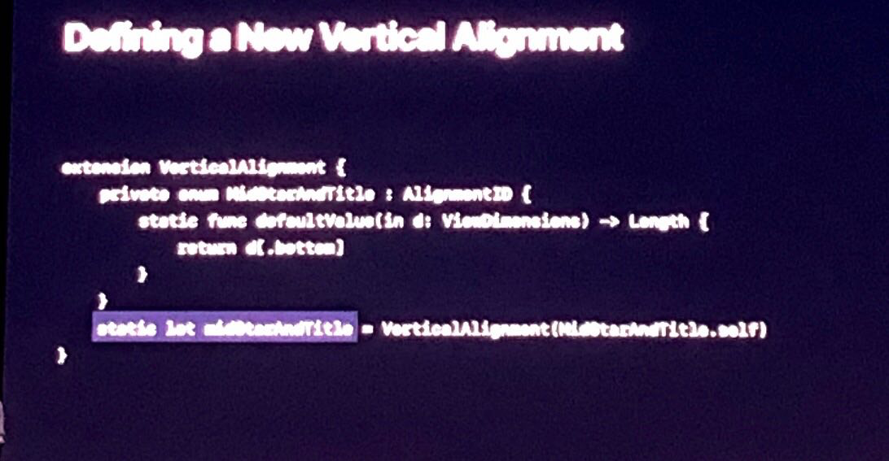

WWDC19
# Table of Contents
=================

   * [Building Custom Views with SwiftUI - Friday](#building-custom-views-with-swiftui---friday)
      * [Layout Procedure](#layout-procedure)
         * [How Stacks Work](#how-stacks-work)
         * [Layout Priority](#layout-priority)
         * [Alignments](#alignments)
         * [Defining a New Vertical Alignment](#defining-a-new-vertical-alignment)
      * [Graphics in SwiftUI](#graphics-in-swiftui)

# Building Custom Views with SwiftUI - Friday
Session materials: https://developer.apple.com/videos/play/wwdc2019/237/

Checking out the code in this session is highly suggested to understand different cases

## Layout Procedure
1. Parent proposes a size for child
2. Child chooses its own size
  - Depending on the UI they choose their own dimensions, be it fixed width height, aspect ratio or intrinsic textfield
3. Parent places child in parent's coordinate space
4. SwiftUI rounds coordinates to nearest pixel

- In SwiftUI images are having fixed sizes based on their own dimensions
  - This means that images will always have the size of their own even if a bigger bounding frame is provided
  - This is as it should be! Designers should provide perfect image dimensions

- When not defined explicitly, "Adaptive spacing" chooses the best spacing between items according to the human interface guideline
  - ofc, there is always a way to provide custom spacing `anyItem(spacing: someSpacing)`

### How Stacks Work
  - When a stack is laying out views, it lays items starting from the least flexible in terms of dimension and places them. Iteratively, after satisfying minimum requirements, the leftover available space is transferred to the next item to be used. In the end if there is still space, that will be automatically distributed by the stack to satisfy the best looking view.

  - ### Layout Priority
  ```
  Text("Avocado Toast").layoutPriority(1)
  ```
    - Layout priority overrides the automatic sizing and prioritizes a given items spacing and framing
  - ### Alignments
  ```
  HStack(alignment: .lastTextBaseLine) {} // This aligns all the items based on the last text in the container
  ```
    - There is also a possibility to align a specific item based on portions with an `alignmentGuide`

### Defining a New Vertical Alignment



## Graphics in SwiftUI
  - Watch the session for this part explicitly
